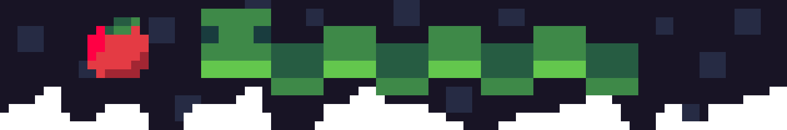

<h1 align=center>🐍 sonolus Snake Engine 🐍</h1>

 <i>My attempt at making a <b>basic snake game</b> for <a href="https://sonolus.com/">Sonolus</a> (huge WIP). </i>

  

If you really want to try out this buggy snake game, you can add the following server url in the Sonolus app: https://lbo44.github.io/Sonolus-Snake-Engine or you can directly click on [this link](https://open.sonolus.com/lbo44.github.io/Sonolus-Snake-Engine).

## 📋 Things I might try to do:
- [x] find good enough sfx 🎵
- [ ] replay mode (I have no clue how)
    - [x] properly load the movement data
    - [x] load the apples in the correct order
    - [ ] draw the whole snake body
    - [ ] add progress bar to allow jumping to any moment of the replay
- [ ] improve visuals ✨
    - [ ] fix death animation
    - [x] screen shake/vibration
    - [x] make the eyes randomly blink
    - [ ] apple eating animation
- [ ] tutorial mode (maybe?) 📖
- [x] ~~create a very basic static website~~
- [ ] host an actual server 🌐
    - [ ] create and host a sonolus express server
    - [ ] support uploading replays
    - [ ] add leaderboards

## 🔗 Links:
- [Sonolus Website](https://sonolus.com/)
- [Sonolus Wiki](https://github.com/NonSpicyBurrito/sonolus-wiki)
- [Sonolus Server Web](https://github.com/Sonolus/sonolus-server-web)
- This repository is based on [Sonolus.js Template (TS)](https://github.com/Sonolus/sonolus.js-template-ts)
    
